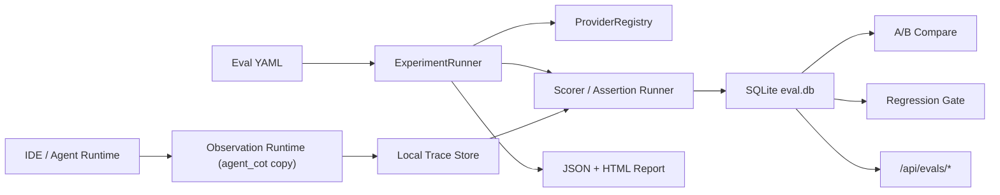

# Agent Quality Eval Implementation Plan

## Research Summary

Agent evaluation needs more than final-answer grading. The product should combine:

- deterministic checks for exact outcomes, schemas, tool use, latency, token/cost, and safety gates
- model-based judges for subjective quality such as correctness, completeness, plan quality, and task completion
- human review as gold labels for calibrating the model judge
- trace review so failures can be explained from tool calls, steps, costs, and intermediate state
- repeated trials with pass@k and pass^k style reliability summaries
- A/B experiments and baseline regression gates before release

This repository implements the local-first version of that loop.

## Architecture

## Delivered MVP

- Created independent project at `D:\agent-quality-eval`.
- Copied observation runtime from `D:\ai-ide-langfuse\agent-cot` without modifying the source repo.
- Added `agent_quality_eval` package and `agent-eval` CLI.
- Added SQLite store with datasets, cases, experiments, runs, trials, scores, baselines, trace links, and human_scores.
- Added declarative YAML/JSON eval config.
- Added providers: mock, OpenAI-compatible, Knot AGUI, custom Python function.
- Added assertions/scorers: content, regex, JSON, length, no-error, response-time, Python expression, LLM rubric, PII, token/cost budget, tool-called, max-tool-calls/step-efficiency.
- Added JSON/HTML reports.
- Added A/B compare and regression gate.
- Added FastAPI router under `/api/evals/*` and mounted it into the copied dashboard backend.
- Added a redesigned `/eval` local workbench for trace-linked session eval, token/cost/latency/tool/error metrics, eval pipeline runs, A/B compare, regression gates, baseline promotion, and experiment browsing.
- Added persisted `session_evals` reports so every observed session can generate and retain an eval report.
- Added an Eval entry button to the bundled observation SPA so users can move from observation to evaluation without remembering routes.
- Added PyInstaller spec for `agent-quality-eval-0.1.0.exe`; no-argument launch bootstraps local state and opens the Eval workbench, command arguments run the CLI.
- Product startup now clears stale observation backend paths from older frozen installs so the exe uses its bundled backend/frontend.
- Added regression tests covering the blocking regression path.
- Built the Windows executable at `D:\agent-quality-eval\dist\agent-quality-eval-0.1.0.exe`.

## Verification

- `py -m pytest -q` passes.
- `dist\agent-quality-eval-0.1.0.exe doctor` exits `0` and reports `agent_cot 1.0.15`.
- `dist\agent-quality-eval-0.1.0.exe eval run ...sample_eval.yaml` writes SQLite records plus JSON/HTML reports and exits `0`.
- A deliberately degraded candidate triggers `eval regression` failure and exits `1`.
- `http://127.0.0.1:<port>/eval` serves the local Eval workbench and can run an eval from the browser.
- Observed sessions can be evaluated from the browser and persist reports with total/input/output/cache tokens, cost, latency, tool count, LLM call count, error count, and score breakdown.

## Next Milestones

1. Replace the injected observation Eval entry with a source-built React navigation item once the original frontend source is copied into this project.
2. Add DB-backed human review queue in the UI.
3. Add richer task-completion scorers over normalized `cot.json`, Claude OTel sessions, and AGUI events.
4. Add statistical confidence intervals for paired A/B runs.
5. Add encrypted secret storage for provider tokens.
6. Add CI templates and release scripts for building the Windows exe.

## Acceptance Criteria

- `agent-eval init` creates a local workspace and sample config.
- `agent-eval eval run <config>` writes SQLite records, JSON output, and HTML report.
- `agent-eval eval compare --baseline A --candidate B` reports win/tie/loss and deltas.
- `agent-eval eval regression --baseline A --candidate B` exits non-zero when regression policy fails.
- `agent-eval observe start` delegates to the copied observation dashboard.
- Original `D:\ai-ide-langfuse` remains unchanged except for read-only copy operations.
