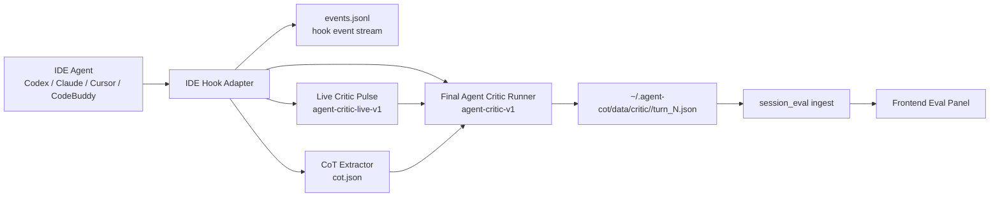

# Agent Judge 技术报告：Hook 驱动的只读评审 Agent（0.1.21-0.1.28）

## 1. 前言：从 LLM Judge 到 Agent Judge

早期评测链路主要是 LLM Judge：在 trace 或 CoT 数据落盘之后，后端把结构化运行数据、工具调用、最终回复等信息拼成 prompt，再调用一个评审模型输出语义评审结果。这种方式可以较快补齐“断言规则无法覆盖的主观质量判断”，但它本质上是 post-hoc 的模型评审，存在三个产品化问题：

1. 评审触发点不在 IDE/Agent 执行链路内，用户难以判断“评审是否真的伴随主 agent 执行过程发生”。
2. 评审来源不清晰，容易把 hook 阶段产物、手动重跑结果、纯兜底断言混在一起展示。
3. 缺少执行中的监督状态，用户在 trace 已出现但 eval 尚未生成时不知道系统是在运行、失败还是未触发。

0.1.21 到 0.1.28 的改造目标，是把语义评审层从 LLM Judge 升级为 Agent Judge，也就是由 IDE hook 触发一个只读的 Agent Critic sidecar，在主 agent 执行过程中记录 live supervisor 状态，并在 turn 边界生成最终评审 report。LLM Judge 只作为历史背景保留，不再作为产品主路径。

## 2. 产品目标与边界

Agent Judge 的产品目标如下：

- Hook 优先：Codex、Claude Code、Claude Internal、Cursor、CodeBuddy 都应由 IDE hook 触发 critic sidecar。
- 只读运行：critic 不能修改用户 workspace，不能阻塞主 agent，失败也不影响主 agent 正常完成。
- 实时监督：主 agent 执行期间，live critic pulse 记录 hook 事件、风险、工具动作和监督摘要。
- 最终报告：turn 边界触发 final critic，把 trace、turn、工具结果和 live supervisor 状态整合成结构化 JSON 与自然语言结论。
- 来源透明：前端必须显示 eval 来源，包括 hook 阶段 report、hook running/interrupted、manual Agent Critic fallback 等。
- 手动 Eval 仍是 Agent Judge：当 hook report 缺失或 stale 时，用户点击 Eval 可以触发同一套 Agent Critic runner 做兜底，但来源必须标记为 manual-agent-critic-fallback，不能伪装成 hook 产物。
- 历史 trace 不自动排队：历史会话只在用户点击 Eval 时处理，避免打开平台后所有旧 trace 都进入排队状态。

非目标：

- 不把 deterministic assertions 当成语义评审结果。断言只用于运行统计、安全门禁和无 critic report 时的轻量兜底展示。
- 不承诺所有 IDE 都有稳定的“原生 subagent 定义格式”。当前产品主路径是 hook-triggered sidecar agent；原生 subagent definition 属于 best-effort 适配。
- 不在用户未配置凭证时擅自选择未知供应商或写入私钥。

## 3. 总体架构

Agent Judge 分为四层：IDE adapter、hook runtime、critic runner、前端展示。



执行链路：

1. 新 exe 启动时自动 bootstrap observation runtime，并刷新四类 IDE 的 hook 脚本、runtime.json 和配置合并结果。
2. IDE 在用户交互、工具调用、Stop、SessionEnd 等生命周期事件触发 hook。
3. hook 首先写入事件流，然后调用 live critic pulse，形成执行中的只读监督状态。
4. 在 Stop、SubagentStop、SessionEnd、StopFailure 等 turn/session 边界，hook 触发 CoT extract 与 final critic runner。
5. final critic runner 读取 cot.json 与 live supervisor 状态，调用配置的 critic 模型，生成最终 Agent Judge report。
6. 前端点击 Eval 时，优先读取 hook 阶段 report；如果没有 report 或 report 已 stale，则触发 manual Agent Critic fallback，并明确标注来源。

## 4. 核心数据模型

### 4.1 Final Agent Critic Report

final report schema 为 `agent-critic-v1`，落盘位置：

```text
~/.agent-cot/data/critic/<session_id>/turn_<turn_index>.json
```

关键字段：

| 字段 | 说明 |
| --- | --- |
| `schema_version` | 固定为 `agent-critic-v1` |
| `eval_method` | 当前为 `agent_critic_v1` |
| `critic_agent` | 当前为 `agent-quality-critic` |
| `agent_type` | codex / claude / cursor / codebuddy 等 |
| `session_id` | 被评审 trace 的 session id |
| `turn_index` | 被评审的 turn index |
| `source_event` | 触发来源，如 `codebuddy-stream:Stop`、`codex-stream:Stop`、`manual-agent-critic-fallback` |
| `status` | `running` / `queued` / `completed` / `error` / `disabled` / `unconfigured` |
| `summary_conclusion` | 前端高亮展示的一段自然语言结论 |
| `overall_verdict` | `resolved` / `partial` / `unresolved` |
| `task_completion` | 任务完成度维度 |
| `tool_use` | 工具使用维度 |
| `reasoning` | 推理路径维度 |
| `instruction_following` | 指令遵循维度 |
| `faithfulness` | 忠实度维度 |
| `efficiency` | 效率维度 |
| `reliability` | 可靠性维度 |
| `review_markdown` | 前端详情区可渲染的 Markdown 评审正文 |
| `live_supervisor` | 关联的 live critic 状态快照 |
| `token_usage` | critic 模型调用的 token 统计 |

其中 `summary_conclusion` 是本次产品化新增的强约束字段，必须用自然语言总结整体判断、用户诉求、agent 关键动作、交付价值和主要风险，供前端以“结论：……”形式高亮展示。

### 4.2 Live Critic Supervisor State

live supervisor schema 为 `agent-critic-live-v1`，落盘位置：

```text
~/.agent-cot/data/critic_live/<session_id>/state.json
~/.agent-cot/data/critic_live/<session_id>/turn_<turn_index>.json
```

关键字段：

| 字段 | 说明 |
| --- | --- |
| `eval_method` | `live_critic_supervisor_v1` |
| `critic_runtime` | `hook_pulse_sidecar` |
| `trigger_source` | `ide_hook_live` |
| `status` | `running` / `completed` / `error` |
| `event_count` | 已观察 hook 事件数 |
| `event_counts` | 按事件类型聚合 |
| `turn_index_approx` | hook 侧估计 turn index |
| `risk_level` | `low` / `medium` / `high` |
| `live_summary` | 执行中监督摘要 |
| `observations` | 风险、工具、文件变化等观察点 |
| `model_snapshots` | 需要时由轻量 critic 模型生成的监督备注 |

live supervisor 不宣称最终任务成功，它只回答“执行过程中看到了什么”。最终交付判断仍由 final Agent Critic 在 turn 边界完成。

## 5. Agent Judge 执行流程

### 5.1 执行中监督

每次 IDE hook 触发时，hook 会调用 live critic runner：

```text
agent-quality-eval.exe --agent-quality-eval-runner live-critic
```

live critic 会记录：

- turn/session 是否开始或结束；
- 工具调用前后事件；
- 文件变更事件；
- subagent/task 创建与完成；
- permission denied、tool failure、stop failure 等风险事件；
- 聚合后的 event_count、risk_level 和 live_summary。

这部分是产品意义上的“实时监督”。它不是最终 eval report，但它保证 Agent Judge 不只是等会话结束后看 CoT 做马后炮分析。

### 5.2 Turn 边界最终评审

在 Stop、SubagentStop、SessionEnd、StopFailure 等边界事件上，hook 会触发 final critic runner：

```text
agent-quality-eval.exe --agent-quality-eval-runner critic
```

runner 行为：

1. 等待 cot.json 落盘，默认等待窗口 45 秒。
2. 找到对应 session 的 cot.json 后定位 turn。
3. 写入 `running` placeholder，前端可看到“正在生成”状态。
4. 读取 live supervisor 状态，并拼接 trace、工具、运行统计、最终回复等上下文。
5. 调用配置的 critic 模型，生成结构化 JSON 与自然语言结论。
6. 写回 final report，并通过 `session_eval.py` ingest 成前端 Eval 面板数据。

### 5.3 手动 Eval 的边界

前端 Eval 按钮不是旧 LLM Judge 入口，而是 Agent Judge 的用户触发入口：

- 如果存在 completed hook report：直接读取并展示，速度应接近本地读取。
- 如果存在 fresh `running/queued` hook report：返回“仍在生成”，不把 placeholder 渲染成完成报告。
- 如果存在 stale `running/queued` hook report：允许用户点击 Eval 触发 manual Agent Critic fallback。
- 如果完全没有 hook report：点击 Eval 触发 manual Agent Critic fallback，并标注 `source_event=manual-agent-critic-fallback`。

因此，manual fallback 的技术路径仍是 Agent Critic runner，不是旧 LLM Judge；区别在于它不是 hook 阶段产物，前端必须如实展示来源。

## 6. 多 IDE Hook 接入

| IDE | 配置路径 | Hook 脚本 | 触发策略 | Agent Judge 行为 |
| --- | --- | --- | --- | --- |
| Codex | `$CODEX_HOME/hooks.json` | `$CODEX_HOME/hooks/codex_stream_hook.py`、`codex_sidecar_collector.py` | `PostToolUse`、`PostCompact`、`Stop`、`SubagentStop` 采集；`Stop`、`SubagentStop` final critic | hook 写事件、触发 live critic、边界触发 final critic |
| Claude Code | `~/.claude/settings.json` | `~/.claude/hooks/claude_stream_hook.py` | 注册 27 个 Claude hook event；`Stop`、`SubagentStop`、`SessionEnd`、`StopFailure` final critic | 兼容 Claude transcript 与 hook payload |
| Claude Internal | `~/.claude-internal/settings.json`，兼容历史误拼 `~/.claude-inertnal/settings.json` | 对应目录下 `hooks/claude_stream_hook.py` | 与 Claude Code 相同 | 保留 `.claude`，新增 internal 镜像写入，不删除用户原配置 |
| Cursor | `~/.cursor/hooks.json` | `~/.cursor/hooks/cot-stream.js`、`cot-bridge.js` | 高频 event 进入 stream；`stop`、`afterAgentResponse`、`SessionEnd`、`StopFailure` final critic | Node hook 写事件、触发 live critic、边界触发 final critic |
| CodeBuddy | `~/.codebuddy/settings.json` | `~/.codebuddy/hooks/cot-stream-codebuddy.js` | PascalCase hook；`Stop`、`SessionEnd`、`SubagentStop`、`StopFailure` final critic | 独立于 Cursor schema，保留第三方 hook，边界触发 Agent Critic |

所有 IDE 的 adapter 都应遵守同一原则：配置合并必须幂等，刷新 agent-cot 自己的 hook 时不能覆盖用户第三方 hook。

## 7. 模型策略

Agent Critic 默认使用低成本 critic 模型，当前默认配置为：

```text
provider = timiai
model = gpt-4o-mini
timeout = 120s
```

前端“Critic 模型设置”和本地配置允许用户覆盖 provider、model、api key。当前支持 TIMIAI 与 DeepSeek provider，TIMIAI 模型列表包括 `gpt-4o-mini`、`gpt-5.4`、`gpt-4o`，DeepSeek 模型列表包括 `deepseek-chat`、`deepseek-reasoner`。

产品策略是“内置可工作的默认低成本模型 + 用户可覆盖”。如果没有 API key 或模型调用失败，系统不会伪造 completed hook report，而是显示 `unconfigured`、`error` 或 deterministic assertions 兜底状态，并在来源说明中明确标注。

## 8. 前端产品行为

Agent Judge 在前端的核心展示约束：

1. 未评估 trace：只展示简洁的 Eval 操作入口，不展示大段解释。
2. hook 正在生成：展示 Agent Critic 正在生成或等待落盘状态。
3. hook stale/interrupted：展示 hook 已触发但未完成，并允许点击 Eval 走 manual Agent Critic fallback。
4. hook completed：展示来源为 hook 阶段产物，显示 `source_event`、token usage、断言结果、维度评审和自然语言结论。
5. manual fallback completed：展示来源为手动 Agent Critic fallback，不能写成 hook 阶段产物。
6. review_markdown 渲染时保留加粗、段落和列表，不把 `###` 原样错误展示为正文。
7. 不再展示“最终判定”冗余章节，最终判断只保留在结构化字段和结论高亮区。

## 9. 版本迭代矩阵

| 版本 | 目标 | 关键改动 | 修复/验证点 |
| --- | --- | --- | --- |
| 0.1.21 | Agent Judge 产品化起点 | 用 hook 触发的只读 Agent Critic sidecar 替换 LLM Judge 主路径；定义 `agent-critic-v1` report schema；引入 `summary_conclusion`、七个评估维度和 `review_markdown` | 安装新 exe 后自动 bootstrap IDE hooks；前端设置从 LLM Judge 语义迁移到 Critic 模型设置 |
| 0.1.22 | 前端交互收敛 | Eval 结果改为用户点击 Eval 后展示；手动触发仍走 Agent Critic；优化完成态、Markdown、结论展示 | 删除完成态感叹号；修正 `###` Markdown 渲染；删除“最终判定”冗余块；简化未 Eval trace 文案 |
| 0.1.23 | 来源语义澄清 | 区分 hook-generated report 与 manual Agent Critic fallback；前端展示 `source_event` 和 hook provenance | 避免“hook 触发但不是 hook 产物”的歧义；如果 `source_event` 来自 IDE stream，则展示来自 hook |
| 0.1.24 | 靠近实时监督需求 | 强化 live supervisor 概念；hook pulse 在 agent 执行期间记录监督状态；历史 trace 不再自动排队 | 新 trace 在生成过程中可显示 critic 正在生成；旧 trace 不再批量进入 queued |
| 0.1.25 | Claude Internal 支持 | 新增 `.claude-internal` 与历史误拼 `.claude-inertnal` 路径适配；保留 `.claude` 配置 | 企业内部 Claude Code 封装可注册 hook；不删除原生 Claude 配置 |
| 0.1.26 | 多 IDE hook 闭环排查 | 对 Codex、Claude、Cursor、CodeBuddy hook 触发、report 落盘、前端 provenance 做统一排查；manual fallback 明确为 Agent Critic | 解决 hook 未触发时前端状态不清晰；补充 hook/report 状态说明 |
| 0.1.27 | Frozen exe runner 硬化 | 新增 `--agent-quality-eval-runner critic|live-critic`；hook 在 runtime python 为 exe 时直接使用 runner flag | 修复 frozen exe 不兼容 `-c` 调用的问题；CodeBuddy/Codex/Claude/Cursor hook 均使用统一 runner |
| 0.1.28 | stale running 与 runner 被杀修复 | `_stop_other_eval_processes()` 保护 critic/live-critic runner；`INCOMPLETE_REPORT_STALE_SECONDS=600`；fresh running 返回 409；stale running 允许 fallback；选择最佳 live supervisor state | 修复 hook 已触发但 final report 长期 running；前端不再把 running placeholder 渲染成完成报告；本地 exe SHA256 已校验 |

0.1.28 构建物：

```text
D:\agent-quality-eval\dist\agent-quality-eval-0.1.28.exe
SHA256: BC0E5F99191F7B76B8E7AFBE99CBA951CD09BDC53C79F2330EE11771A45CCE85
```

## 10. Bug 修复汇总

| 问题 | 现象 | 根因 | 修复 |
| --- | --- | --- | --- |
| 历史 trace 全部排队 | 打开平台后大量历史会话显示 queued | 后端/前端把无 report 的历史 trace 当成自动待评审 | 取消历史自动排队，仅用户点击 Eval 时处理 |
| Eval 来源不清 | hook 触发后仍显示“不是 hook 产物” | 来源文案只按是否自动展示区分，没有按 `source_event` 区分 | 使用 `source_event` 和 report status 展示 provenance |
| CodeBuddy/Codex hook 触发但 report 慢或缺失 | 点击 Eval 后像重新跑模型，且 hook report running | frozen exe runner 被启动/升级流程杀掉，或 hook 用 `-c` 调 exe 不兼容 | 0.1.27 加 runner flag；0.1.28 保护 runner 进程 |
| running placeholder 被当完成报告 | 前端出现 0 token、断言完成但 Agent 评测仍 running | `session_eval.py` ingest 时没有把 incomplete report 与 completed report 区分 | running/queued 返回 running/interrupted 状态，不渲染成 completed |
| stale running 长期卡住 | 20 分钟后仍显示 running | 缺少 stale 判断和用户可恢复路径 | 10 分钟后视为 stale incomplete，允许 manual Agent Critic fallback |
| live state 选择错误 | final report 关联到 stale turn live state，而 global state 已 completed | turn-specific 与 global live state 没有按状态和事件数择优 | 新增 `load_best_live_critic_state()`，按 status rank、event_count、updated_at 选择 |
| Markdown 渲染异常 | 详情区大量 `###` 裸露 | review_markdown 渲染链路没有按产品 UI 转换标题 | 调整前端 Markdown 渲染与内容结构，保留加粗与段落 |
| 重复结论 | 高亮区和详情区出现两段一模一样结论 | `summary_conclusion` 与 `review_markdown` 重复展示策略不清 | 高亮区保留自然语言结论，详情区避免重复冗余 |
| “最终判定”冗余 | 页面底部出现额外最终判定模块 | LLM Judge 时代的结构被沿用 | 删除单独“最终判定”章节 |
| Claude Internal 无 hook | 企业封装版 Claude 使用 `.claude-internal`，原先只写 `.claude` | adapter 未覆盖 internal 目录 | 新增 `.claude-internal` 与 `.claude-inertnal` 适配，并保留 `.claude` |
| 手动 Eval 边界模糊 | 用户担心手动 Eval 退回 LLM Judge | API 命名和旧配置仍含 llm_judge 兼容字段 | 手动 Eval 调用 `run_critic_for_cot(... source_event="manual-agent-critic-fallback")`，技术路径仍是 Agent Critic |

## 11. 测试与验证

已覆盖的测试方向：

- Adapter tests：四类 IDE hook/definition 路径、幂等合并、第三方 hook 保留、升级刷新。
- Runner tests：合法 JSON、非法 JSON fallback、timeout、只读 sandbox/env、`summary_conclusion` 必填。
- Hook contract tests：Codex、Claude、Cursor、CodeBuddy hook 均包含 `--agent-quality-eval-runner` 调用。
- Eval ingest tests：completed hook report 写入 `turn_evals`；running/queued 不误渲染为 completed；manual fallback 标注 provenance。
- Frontend build：Agent Critic 状态、自然语言结论高亮、running/interrupted/error/queued 状态展示。
- Frozen exe smoke：双击 exe 后自动 bootstrap runtime 与 detected IDE hooks。

0.1.28 本地验证记录：

```text
py -3.12 -m pytest -q
209 passed

npm run build
passed

agent-quality-eval-0.1.28.exe
SHA256: BC0E5F99191F7B76B8E7AFBE99CBA951CD09BDC53C79F2330EE11771A45CCE85
```

## 12. 仍需关注的风险

1. turn index 对齐仍有 IDE 差异。live supervisor 的 `turn_index_approx` 是 hook 侧估计值，最终以 cot.json 中的 turn 为准。
2. CodeBuddy、Cursor 等 IDE 的 hook contract 可能随版本变化，需要 doctor/health 面板持续检测。
3. 原生 subagent definition 仍是 best-effort，当前可靠闭环以 hook sidecar 为主。
4. critic 模型调用依赖用户配置的 provider/API key，未配置时只能展示 unconfigured 或 deterministic fallback。
5. hook 日志与 critic report 需要后续增加保留周期和清理策略，避免长期运行后本地数据过大。

## 13. 下一步建议

- 增加 Hook Health 面板：逐 IDE 展示 hook config 是否存在、脚本 hash 是否匹配、最近一次 hook event、最近一次 critic_spawn、最近一次 report_written。
- 增加单 trace provenance 时间线：把 `hook event -> live pulse -> extract -> final critic -> frontend ingest` 串成可视化链路。
- 对 CodeBuddy / Cursor 增加更强的版本探测与 contract 校验。
- 对 stale running 增加自动恢复策略：在用户点击 Eval 前，后台可尝试一次轻量恢复，但必须明确标注来源。
- 将 Agent Critic prompt 与 schema 版本化，便于后续比较不同 critic 模型或 prompt 版本的稳定性。

